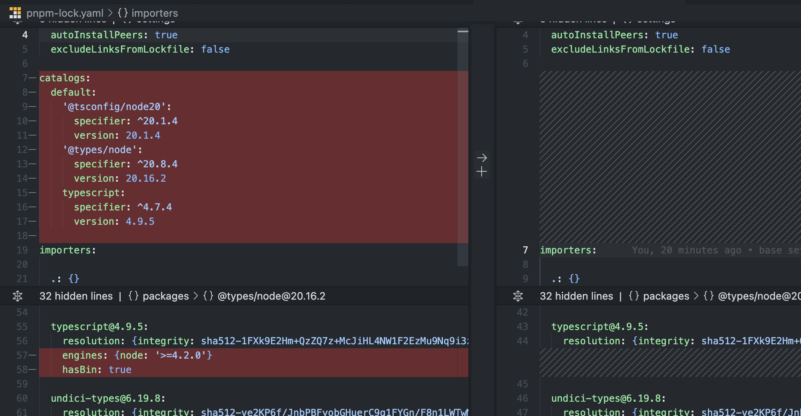

# PNPM Catalog bugs

## 1. Specifier changes but resolved version is still the same

### Settings that seem to be causing this:
- `recursive-install=false`

### Steps to reproduce:
1. Set in .npmrc `recursive-install=false`
2. Change a version in `pnpm-workspace.yaml` (e.g. typescript)
3. Run either `pnpm i --lockfile-only` or `pnpm i` from the root of the repository

### Current behavior

Only the `specifier` of the catalog dependency gets changed but the `resolved` version is still the old one.

#### Secondary behavior

If running `pnpm i` from a package (e.g. inside the directory `packages/package-a`). Only that packages starts resolving the new version and the catalog still refers to the old one.

### Expected behavior

That the resolved version for all packages gets updated. Like when using `recursive-install=true` instead.

IMHO as the catalog is a centralized configuration, all packages should be updated independently of the recursive-install setting.

## 2. pnpm install --fix-lockfile removes the catalog definition.

### Settings that seem to be causing this:

- `recursive-install=false`

### Steps to reproduce:

1. Set in .npmrc `recursive-install=false`
2. Run `pnpm i --fix-lockfile` from the root of the repo

### Current behavior

Catalog definition gets removed from lockfile.

### Expected behavior

Catalog definition stays in the lockfile.
